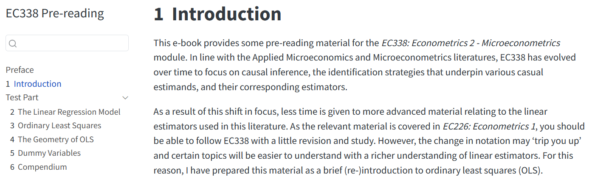
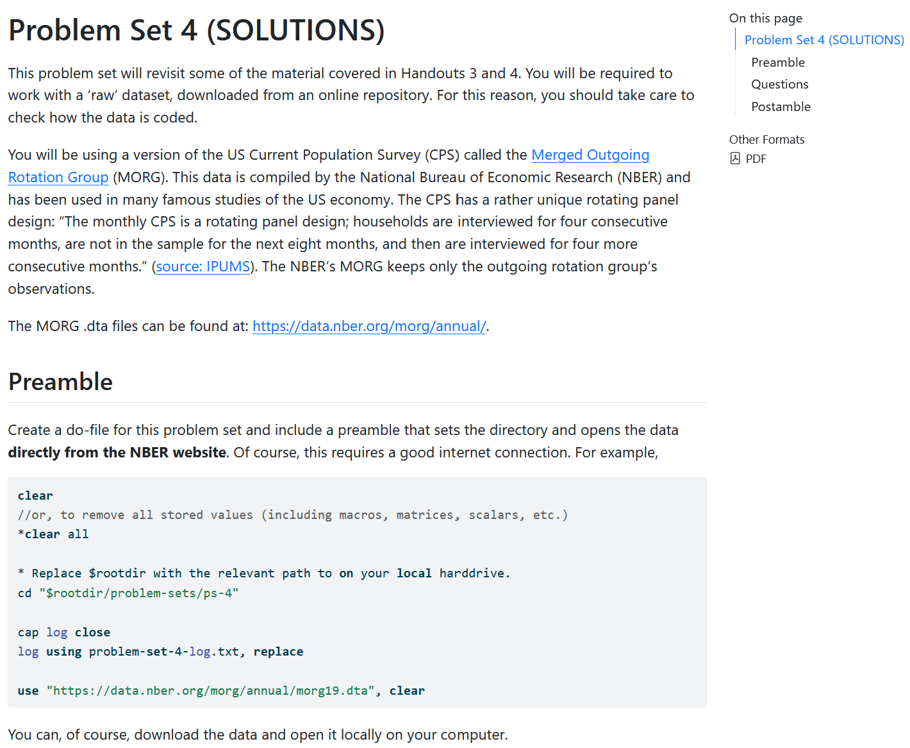
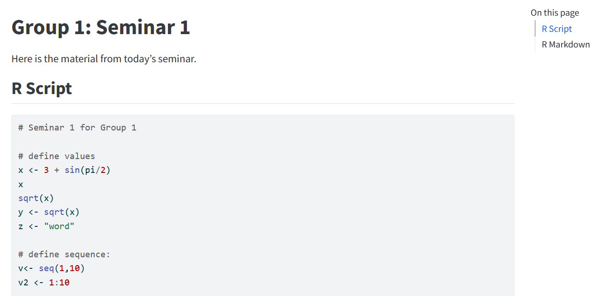

Over the past two years, I have been experimenting with the creation of web-based teaching material using RStudio's [Quarto](https://quarto.org/) publishing system. Quarto allows allows for parallel publishing in html and pdf (via LaTeX). This has many pedagogical and accessibility benefits.[^1]

[^1]: Commonly used screen readers cannot interpet math-type published in a pdf using LaTeX. They are however able to read math-type published in a html using LaTeX. Html also has other accessibility benefits, like dark-mode and zoom functionality. 

## Pre-reading for EC338

I began be creating a short pre-read for students choosing EC338 in 2022: <https://neillo88.github.io/ec338-preread/>. A recommended text for the module is Angrist & Pischke's *Mostly Harmless Econometrics*, which includes a lot of linear algebra notation. I wanted to create a short text that would help students with an undergraduate introduction to Econometrics understand the notation used in this and other more advanced texts. 

::: {.column-margin}

:::

## Website for EC910

The second project was more advanced. Upon taking over module leadership of EC910 in 2024, I decided to move all material to an html-based format <https://neillo88.github.io/warwick-ec910/>. The experience demonstrated three strengths to the platform: (1) updating mistakes, (2) dual publication, and (3) embedding code. With a new module, there are always going to be mistakes in your notes, but Quarto-GitHub Pages publishing experience makes it easy to fix and push corrections to students. Second, giving choice to students works! Some students downloaded the pdf to annotate, while others liked to refer to the html pages. Finally, the ease with which you can embed coding is extremely valuable pedagogically. This is something I want to explore more moving forward. 

::: {.column-margin}

:::

## Seminar Material for EC349

Finally, in 2025 I joined EC349 as the module's seminar tutor. Data Science felt like a natural opportunity to explore this tool in a more collaborative learning environment: <https://neillo88.github.io/warwick-ec349/>. Instead of explaining to students the benefits of Git and GitHub, I can demonstrate these first hand through the updates I make to this website throughout the term. In addition, they get to see the flexibility of publishing in html (over pdf and word). I tried a few interactive exercises with mixed results. For the first seminar, we created a unique file in each class that I then shared with the class with a simple re-rendering of the website and GitHub push at the end of class. For the second seminar, I invited students to share alternative solutions and posted these on the website. 

::: {.column-margin}

:::